# Группы пользователей

## Пользователи по орг. структуре

- Специалист ИБ
- DevOps-инженер
- Инженер по эксплуатации
- Менеджер операционной команды

## Таблица ролей

| Роль  | Права роли | Группы пользователей |
| --- | --- | --- |
| ``security-auditor`` | Права ``get``, ``watch``, ``list`` на ресурсы ``Pods``, ``Deployments``, ``StatefulSets``, ``DaemonSets``, ``Services``, ``ConfigMaps``, ``Secrets``, ``NetworkPolicies``, ``RoleBindings``, ``ClusterRoleBindings``. Права ``get``, ``list`` на доступ к логам подов ``pods/log`` | Специалист ИБ |
| ``devops-engineer`` | Полные права (*) в неймспейсах проектов. Без доступа к ресурсам уровня кластера ``nodes``, ``namespaces``, ``clusterroles``, ``storageclasses``, ``priorityclasses`` | DevOps-инженер. |
| ``ops-engineer`` | Права ``get``, ``list``, ``watch`` к основным ресурсам, права просмотра логов подов ``pods/logs``, права на запуск для диагностики ``pods/exec``, права на перезапуск подов ``delete`` (только удаление, контроллер создаст новый под автоматически). | Инженер по эксплуатации |
| ``ops-manager`` | Только ``get``, ``list``, ``watch`` в неймспейсах проекта | Менеджер операционной команды |
| ``cluster-auditor`` | Права ``get``, ``list``, ``watch`` на ресурсы кластера ``ClusterRole``, ``ClusterRoleBinding``, ``Node``, ``Namespace``, ``StorageClass``, ``PriorityClass``, ``CustomResourceDefinition``, ``APIService``, ``CertificateSigningRequest`` | Специалист ИБ (дополнительная роль), Менеджер операционной команды (по запросу) |
| ``cluster-admin`` | Полные права (*) на все ресурсы кластера | Подключается по запросу DevOps-инженерам, инженерам по эксплуатации |

## security-auditor

[security-auditor.yaml](./security-auditor.yaml)

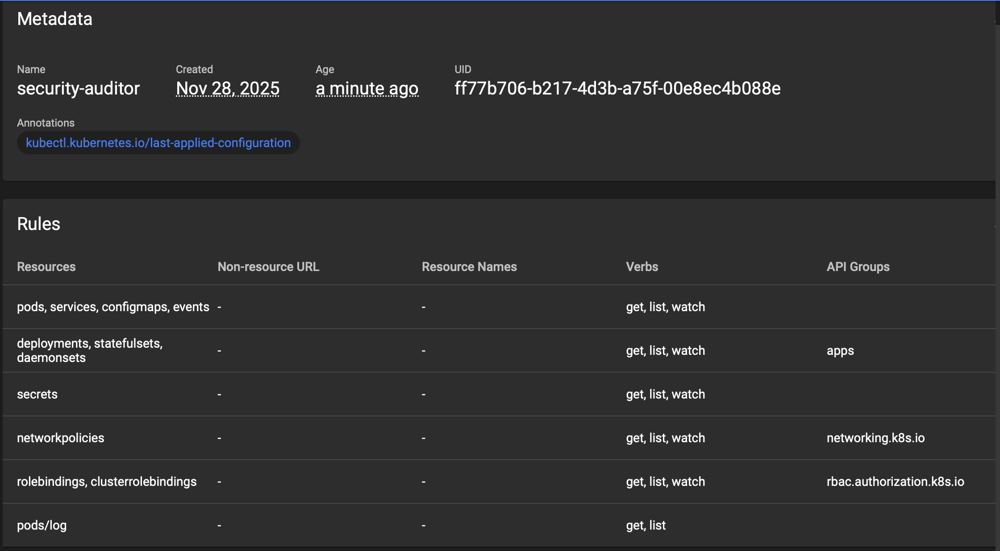

[security-auditor-binding.yaml](./security-auditor-binding.yaml)

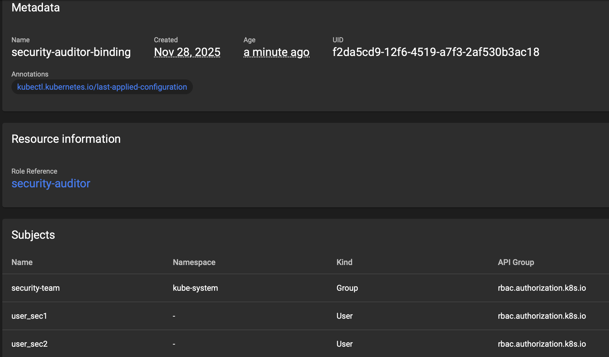

## devops-engineer

[devops-engineer.yaml](./devops-engineer.yaml)

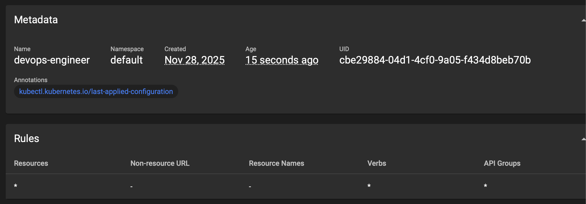

[devops-engineer-binding.yaml](./devops-engineer-binding.yaml)

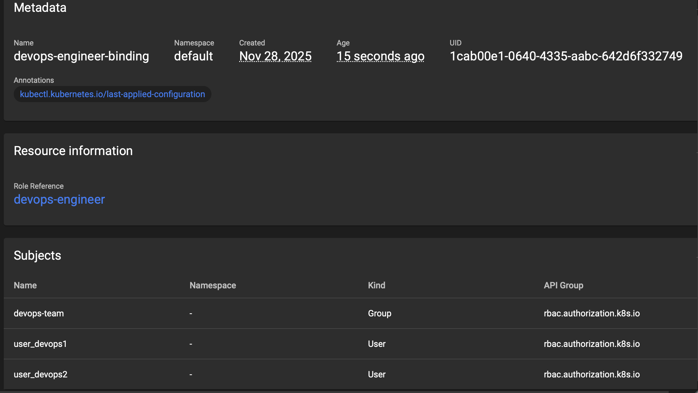

## ops-engineer

[ops-engineer.yaml](./ops-engineer.yaml)

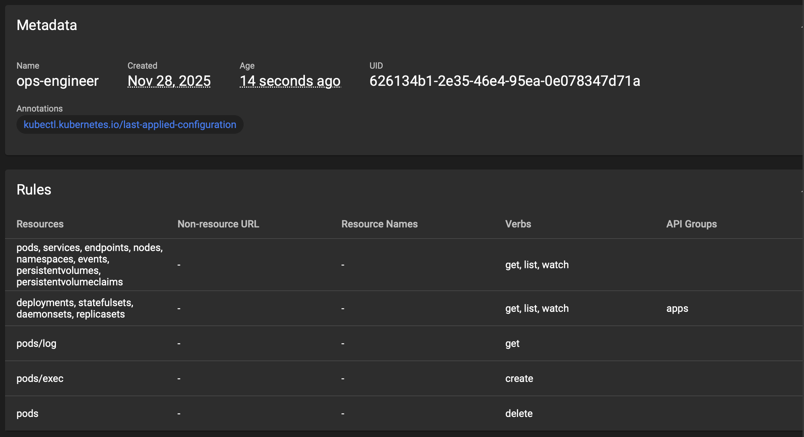

[ops-engineer-binding.yaml](./ops-engineer-binding.yaml)

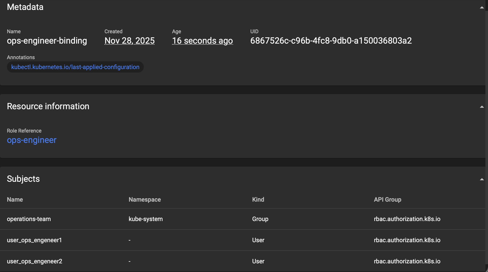

## ops-manager

[ops-manager.yaml](./ops-manager.yaml)

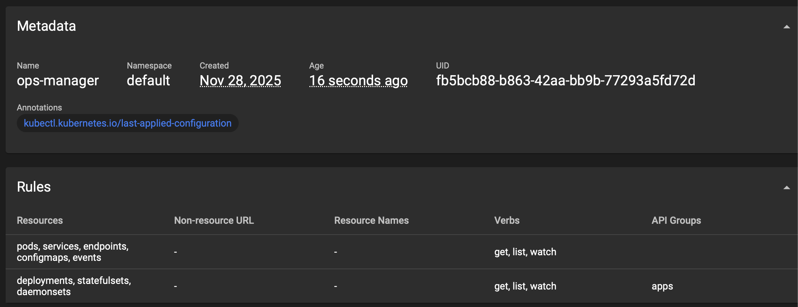

[ops-manager-binding.yaml](./ops-manager-binding.yaml)

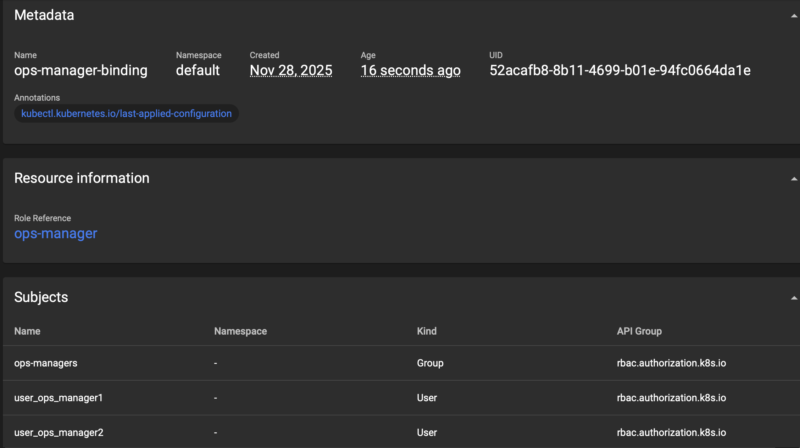

## cluster-auditor

[cluster-auditor.yaml](./cluster-auditor.yaml)

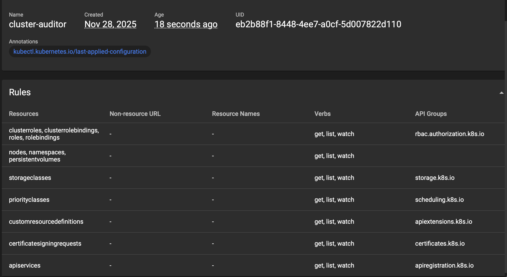

[cluster-auditor-binding.yaml](./cluster-auditor-binding.yaml)

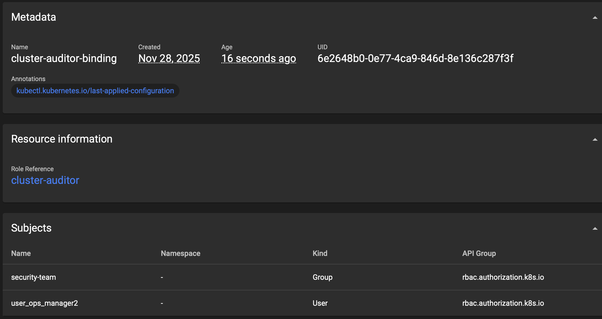

## cluster-admin

[cluster-admin-binding.yaml](./cluster-admin-binding.yaml)

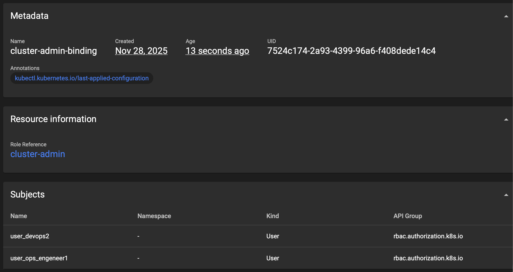

