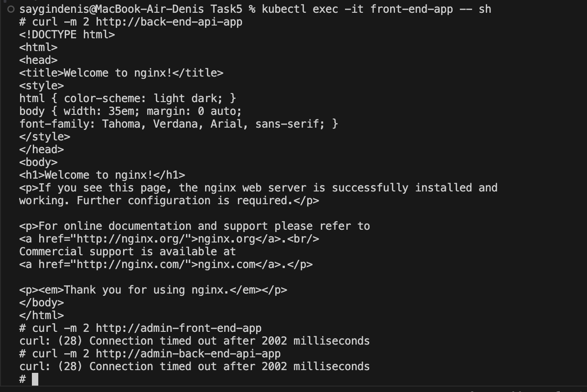
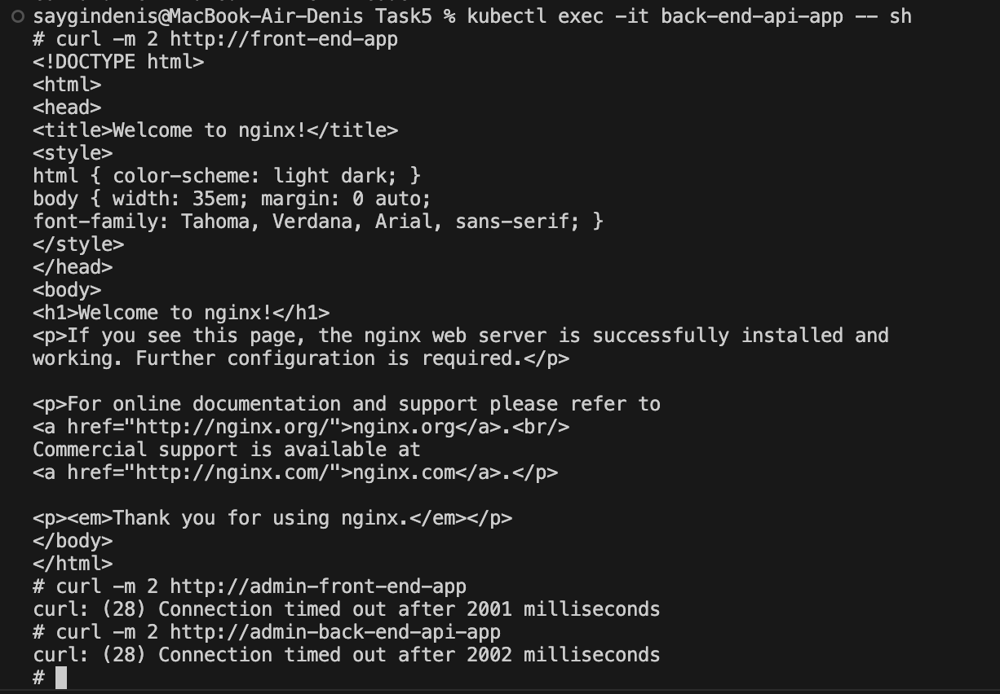
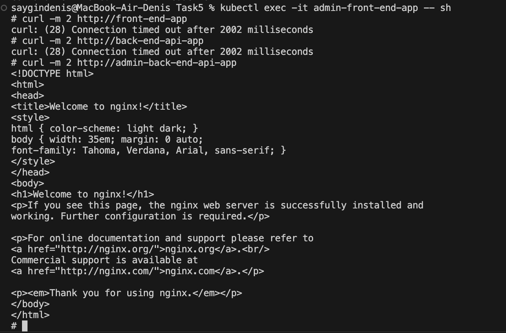
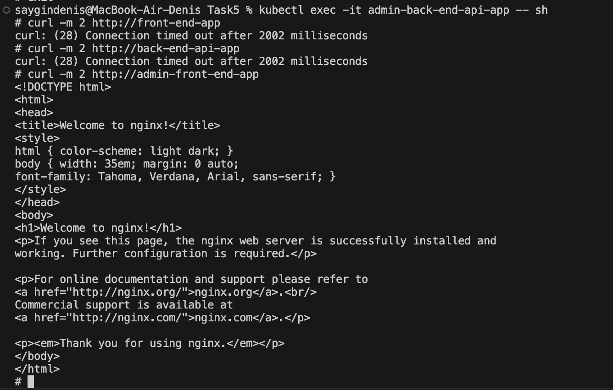

# Управление трафиком внутри кластера Kubertnetes

## Запуск приложений и сетевые политики

Запуск приложений:

```sh
kubectl run front-end-app --image=nginx --labels role=front-end --expose --port 80
kubectl run back-end-api-app --image=nginx --labels role=back-end-api --expose --port 80
kubectl run admin-front-end-app --image=nginx --labels role=admin-front-end --expose --port 80
kubectl run admin-back-end-api-app --image=nginx --labels role=admin-back-end-api --expose --port 80
```

Применить сетевую политику:

```sh
kubectl apply -f non-admin-api-allow.yaml
```

[non-admin-api-allow.yaml](./non-admin-api-allow.yaml)

## Тестирование front-end-app

Подключение к поду ``front-end-app`` для тестирования:
```sh
kubectl exec -it front-end-app -- sh
```

Отправка запросов в "соседние" поды:
```sh
curl -m 2 http://back-end-api-app
curl -m 2 http://admin-front-end-app
curl -m 2 http://admin-back-end-api-app
```

Результат тестирования:


## Тестирование back-end-api-app

Подключение к поду ``back-end-api-app`` для тестирования:
```sh
kubectl exec -it back-end-api-app -- sh
```

Отправка запросов в "соседние" поды:
```sh
curl -m 2 http://front-end-app
curl -m 2 http://admin-front-end-app
curl -m 2 http://admin-back-end-api-app
```

Результат тестирования:


## Тестирование admin-front-end-app

Подключение к поду ``admin-front-end-app`` для тестирования:
```sh
kubectl exec -it admin-front-end-app -- sh
```

Отправка запросов в "соседние" поды:
```sh
curl -m 2 http://front-end-app
curl -m 2 http://back-end-api-app
curl -m 2 http://admin-back-end-api-app
```

Результат тестирования:


## Тестирование admin-back-end-api-app

Подключение к поду ``admin-back-end-api-app`` для тестирования:
```sh
kubectl exec -it admin-back-end-api-app -- sh
```

Отправка запросов в "соседние" поды:
```sh
curl -m 2 http://front-end-app
curl -m 2 http://back-end-api-app
curl -m 2 http://admin-front-end-app
```

Результат тестирования:

