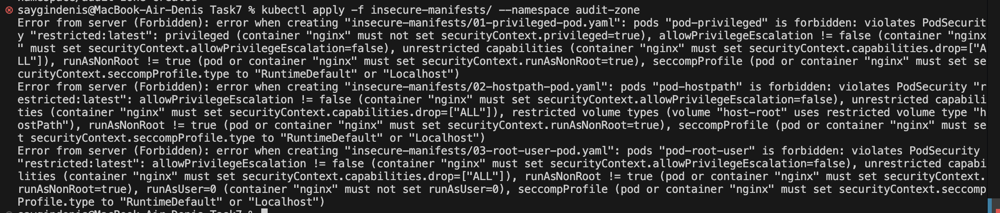
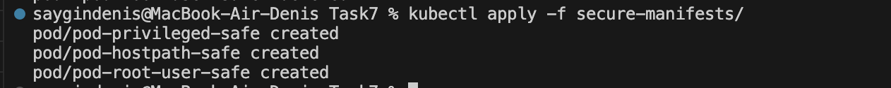
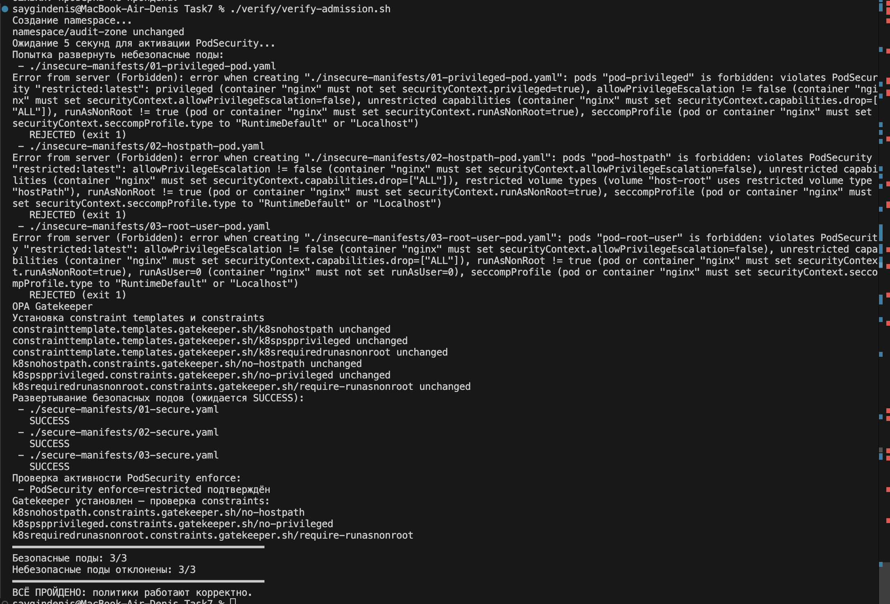
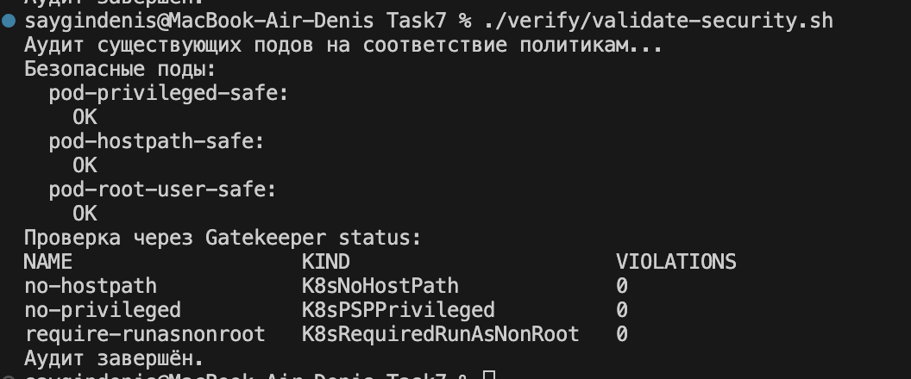

# Аудит и обеспечение соответствия политике безопасности контейнеров (PSP / PodSecurity / OPA Gatekee


## Создание namespace

```sh
kubectl apply -f 01-create-namespace.yaml
```

## Insecure manifrsts

```sh
kubectl apply -f insecure-manifests/ --namespace audit-zone
```



## Secure

```sh
kubectl apply -f secure-manifests/
```



## Настройка OPA Gatekeeper (дополнительный уровень защиты)

Установка

```sh
kubectl apply -f https://raw.githubusercontent.com/open-policy-agent/gatekeeper/v3.21.0/deploy/gatekeeper.yaml
```

Создание ConstraintTemplate'ов и Constraints

```sh
kubectl apply -f gatekeeper/constraint-templates
kubectl apply -f gatekeeper/constraints
```

## Аудит уже существующих Pod’ов (вне audit-zone)

Просмотр аудит-результатов:
```sh
kubectl get k8snohostpath.constraints.gatekeeper.sh/no-hostpath -o jsonpath='{.status.violations}'
kubectl get k8spspprivileged.constraints.gatekeeper.sh/no-privileged -o jsonpath='{.status.violations}'
kubectl get k8srequiredrunasnonroot.constraints.gatekeeper.sh/require-runasnonroot -o jsonpath='{.status.violations}'
```

Или общий аудит:
```sh
kubectl get constraint -o custom-columns=NAME:.metadata.name,KIND:.kind,VIOLATIONS:.status.totalViolations
```

## Скрипты провеки

```
./verify/verify-admission.sh
```




```
./verify/validate-security.sh
```

